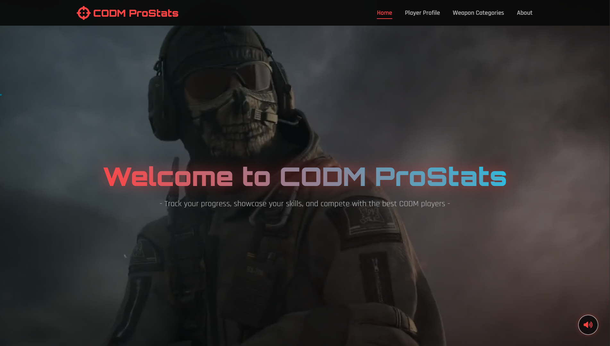
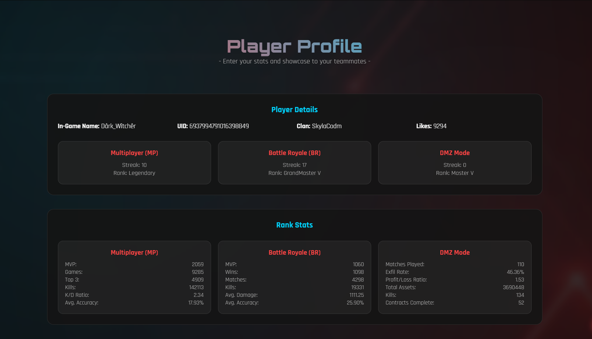
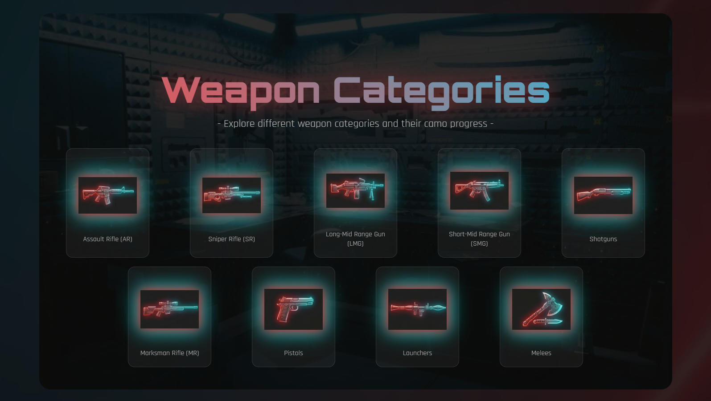

<div align="center">

# ⚔️ CODM ProStats

### *Track your journey like a pro.*


A futuristic, immersive web dashboard for **Call of Duty: Mobile** players to showcase their stats, rank progress, and weapon camo achievements — built with zero frameworks, pure vanilla web technologies.

[Live Demo](https://codm-pro-stats.vercel.app/) · [Report a Bug](https://forms.gle/YdDpB6QsetKfevZ5A) · [Request a Feature](https://forms.gle/YdDpB6QsetKfevZ5A)

</div>

---

## 📸 Screenshots

| Hero Section | Player Profile | Weapon Grid |
|:---:|:---:|:---:|
|  |  |  |

> *Video background hero section, player stats dashboard, and weapon category grid with flip cards.*

---

## 🎯 What is CODM ProStats?

CODM ProStats is a high-performance, mobile-optimized gaming dashboard that brings a **console-grade experience to the browser**. Built for competitive Call of Duty: Mobile players, it consolidates everything in one immersive place — your rank, K/D, win stats, and camo grind progress — all wrapped in a glassmorphism UI with ambient audio and video backgrounds.

### The problem it solves

- Player stats are locked inside the game with no shareable showcase
- No existing tool tracks Gold, Platinum, Diamond, and Damascus progress across all 141 weapons
- Generic stat trackers lack the immersive, game-native aesthetic competitive players expect

---

## ✨ Features

### 👤 Player Profile
- In-Game Name (IGN), UID, Clan, and total Likes display
- Mode streaks and current rank for **Multiplayer (MP)**, **Battle Royale (BR)**, and **DMZ**

### 📊 Mode-Specific Rank Stats
| Mode | Stats Tracked |
|------|--------------|
| Multiplayer (MP) | MVP, Games, Top 3, Kills, K/D Ratio, Avg. Accuracy |
| Battle Royale (BR) | MVP, Wins, Matches, Kills, Avg. Damage, Avg. Accuracy |
| DMZ | Matches, Exfil Rate, P/L Ratio, Total Assets, Kills, Contracts |

### 🔫 Weapon Category Grid
9 weapon categories, each with dedicated pages:
- Assault Rifles (AR) · Sniper Rifles (SR) · LMGs · SMGs
- Shotguns · Marksman Rifles (MR) · Pistols · Launchers · Melees

Each weapon card features:
- 6-stat grid (Damage, Fire Rate, Accuracy, Mobility, Range, Control) with mini progress bars
- Flip animation with sound effect to reveal camo progress
- Gold / Platinum / Diamond / Damascus toggle buttons

### 🎨 Animated Camo Progress
Shimmer-animated progress bars with glow effects for all 4 camo tiers across all 141 weapons, displayed both per-weapon and as an overall overview.

### 🎵 Immersive Experience
- Full-bleed video background on the hero section
- Toggleable ambient soundtrack with a floating mute/unmute button
- Card flip sound effects on weapon detail reveal

### 📱 Fully Responsive
- Mobile-first hamburger navigation
- Fluid weapon grids using CSS Grid with `auto-fit`
- Optimized for all screen sizes

---

## 🛠️ Tech Stack

| Layer | Technology |
|-------|-----------|
| Structure | HTML5 (semantic, multi-page) |
| Styling | CSS3 — Flexbox, Grid, Custom Properties, Keyframe Animations |
| Interactivity | Vanilla JavaScript (ES6+) |
| Fonts | Google Fonts — `Orbitron` (display) + `Rajdhani` (body) |
| Icons | Font Awesome 6 |
| Email | EmailJS (contact integration) |
| Offline | Service Worker (`sw.js`) — PWA cache-first strategy |

**Zero frameworks. Zero npm dependencies. No build step required.**

---

## 🏗️ Project Structure

```
CODM ProStats/
├── index.html          # Main dashboard — hero, profile, weapon categories, camo progress
├── style.css           # All styles — glassmorphism, animations, shimmer effects, responsive
├── script.js           # UI logic — mobile nav, scroll highlighting, music controls
├── sw.js               # Service Worker — offline caching & PWA support
├── manifest.json       # Web App Manifest — installable PWA config
│
├── ar.html             # Assault Rifles (35 weapons)
├── sniper.html         # Sniper Rifles
├── lmg.html            # LMGs
├── smg.html            # SMGs
├── shotgun.html        # Shotguns
├── marksman.html       # Marksman Rifles
├── pistols.html        # Pistols
├── launcher.html       # Launchers
├── melee.html          # Melees
│
├── Guns/               # Weapon images organised by category
│   ├── AR/             # 1.jpg … 35.jpg
│   ├── SR/
│   └── ...
│
└── sounds/
    ├── Card-Flip-Sound.wav   # Flip SFX
    └── Soundtrack.webm       # Ambient background music
```

---

## 🎨 Design System

| Token | Value | Usage |
|-------|-------|-------|
| Primary Red | `#ff4444` | Headings, borders, CTAs, glow effects |
| Secondary Cyan | `#00d4ff` | Accents, links, diamond camo, nav active |
| Dark Background | `#0a0a0a` | Page base |
| Card Surface | `rgba(20,20,20,0.95)` | Weapon cards, panels |
| Display Font | `Orbitron` | Titles, section headers, stat values |
| Body Font | `Rajdhani` | Descriptions, labels, UI text |
| Glassmorphism | `backdrop-filter: blur(8px)` | Navigation, overlays |

---

## ⚡ Performance & PWA

CODM ProStats ships as a **Progressive Web App** with full offline support:

```js
// sw.js — Cache-first strategy
const CACHE_NAME = 'codm-prostats-v1';
const ASSETS = [
  '/', '/index.html', '/style.css', '/script.js',
  '/ar.html', /* ... all pages */
  '/Guns/', '/sounds/'
];

self.addEventListener('install', e => {
  e.waitUntil(caches.open(CACHE_NAME).then(c => c.addAll(ASSETS)));
});
```

- Installable on Android and iOS via `manifest.json`
- All assets served from cache when offline
- Theme color `#0a0a0a` for native dark chrome

---

## 🚀 Getting Started

No build step, no npm install. Just clone and open.

```bash
# Clone the repo
git clone https://github.com/yourusername/codm-prostats.git

# Open in browser
cd codm-prostats
open index.html
```

Or serve locally for Service Worker support:

```bash
# Using Python
python -m http.server 8000

# Using Node (npx)
npx serve .
```

Then visit `http://localhost:8000`

> **Note:** Service Workers require HTTPS or `localhost`. Opening `index.html` directly via `file://` will disable PWA features.

---

## 🗺️ Roadmap

- [x] Multi-page weapon dashboard with flip cards
- [x] Animated camo progress bars with shimmer effects
- [x] Responsive design with mobile hamburger nav
- [x] Background music with mute toggle
- [x] Service Worker for offline PWA support
- [x] In-game stat grid (Damage, Fire Rate, Accuracy, Mobility, Range, Control)
- [ ] React / Next.js component migration
- [ ] Live CODM API integration for automatic stat updates
- [ ] User accounts with persistent camo state (localStorage → backend)
- [ ] Public shareable player profile pages
- [ ] Dark/light theme toggle

---

## 🤝 Contributing

Contributions are welcome! If you have ideas for improvements or spot a bug:

1. Fork the repository
2. Create a feature branch: `git checkout -b feature/your-feature-name`
3. Commit your changes: `git commit -m 'Add: your feature description'`
4. Push to the branch: `git push origin feature/your-feature-name`
5. Open a Pull Request

---

## 📄 License

This project is open source and available under the [MIT License](LICENSE).

---

<div align="center">

**Created with ❤️ by Jatin Kr. Koli**

*CODM ProStats — Track your journey like a pro.*

[](https://github.com/codeswithjatin)
[](https://linktr.ee/codeswithjatin)

</div>
